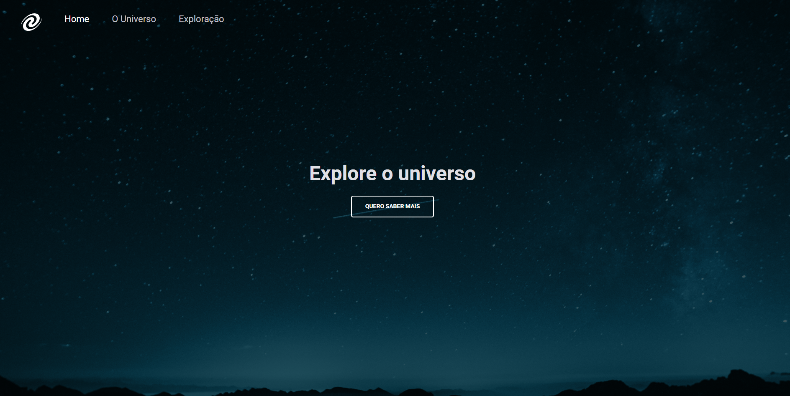

<h1 align="center"> SPA Universe </h1>

  <a href="#technologies">Technologies</a>&nbsp;&nbsp;&nbsp;|&nbsp;&nbsp;&nbsp;
  <a href="#project">Project</a>&nbsp;&nbsp;&nbsp;|&nbsp;&nbsp;&nbsp;
  <a href="#layout">Layout</a>&nbsp;&nbsp;&nbsp;|&nbsp;&nbsp;&nbsp;
  <a href="#license">License</a>&nbsp;&nbsp;&nbsp;|&nbsp;&nbsp;&nbsp;
  <a href="#readme-in-portuguese">README in Portuguese</a>&nbsp;&nbsp;&nbsp;|&nbsp;&nbsp;&nbsp;

 

  

 

  

## Technologies

This project was developed with the following technologies:

- HTML
- CSS
- JavaScript
- Git and Github
- Figma

## Project

Small project developed with the purpose of studying and exercising concepts and applications of Single Page Application (SPA) and Object Oriented Programming (OOP), making it possible to switch between routes and change both its content and its background image.

- To access the finished project, [click here](https://pcbandeira-m.github.io/spa-universe/).

## Layout

This project was developted from the following layout: [click here](https://www.figma.com/file/nuyAXH5HQTfzjBCWhhdqhF/Desafios-Explorer-SPA-Universe-Copy?fuid=1196998376984740990).

## License

This project is licensed under the MIT.

---

by Patricia Melo

`Project created by Rocketseat`

 
 
 

# README in portuguese

 
 

<h1 align="center"> SPA Universe </h1>

  <a href="#tecnologias">Tecnologias</a>&nbsp;&nbsp;&nbsp;|&nbsp;&nbsp;&nbsp;
  <a href="#projeto">Projeto</a>&nbsp;&nbsp;&nbsp;|&nbsp;&nbsp;&nbsp;
  <a href="#layout">Layout</a>&nbsp;&nbsp;&nbsp;|&nbsp;&nbsp;&nbsp;
  <a href="#licença">Licença</a>&nbsp;&nbsp;&nbsp;|&nbsp;&nbsp;&nbsp;

 

  

 

  

## Tecnologias

Este projeto foi desenvolvido com as seguintes tecnologias:

- HTML
- CSS
- JavaScript
- Git e Github
- Figma

## Projeto

Pequeno projeto desenvolvido com a finalidade de se estudar e exercitar conceitos e aplicações do Single Page Aplication (SPA) e da Programação Orientada a Objetos (POO), sendo possível alternar entre as rotas e alterar tanto seu conteúdo quanto sua imagem de fundo.

- Para acessar o projeto finalizado, [clique aqui](https://pcbandeira-m.github.io/spa-universe/).

## Layout

Este projeto foi desenvolvido a partir do seguinte layout: [click here](https://www.figma.com/file/nuyAXH5HQTfzjBCWhhdqhF/Desafios-Explorer-SPA-Universe-Copy?fuid=1196998376984740990).

## Licença

Este projeto está sob a licença MIT.

---

by Patricia Melo

`Projeto criado pela Rocketseat`
